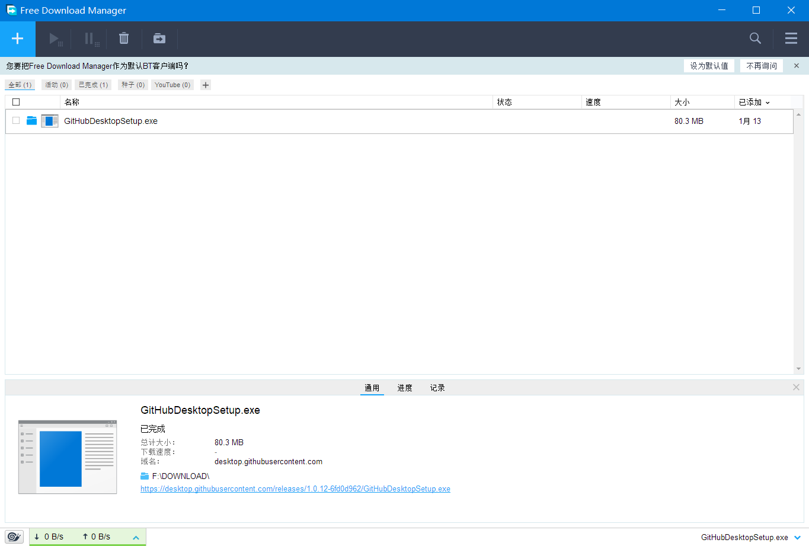
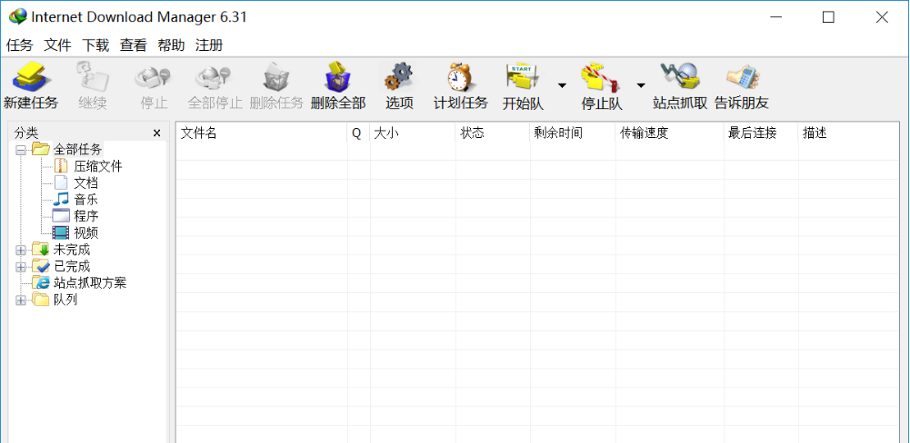
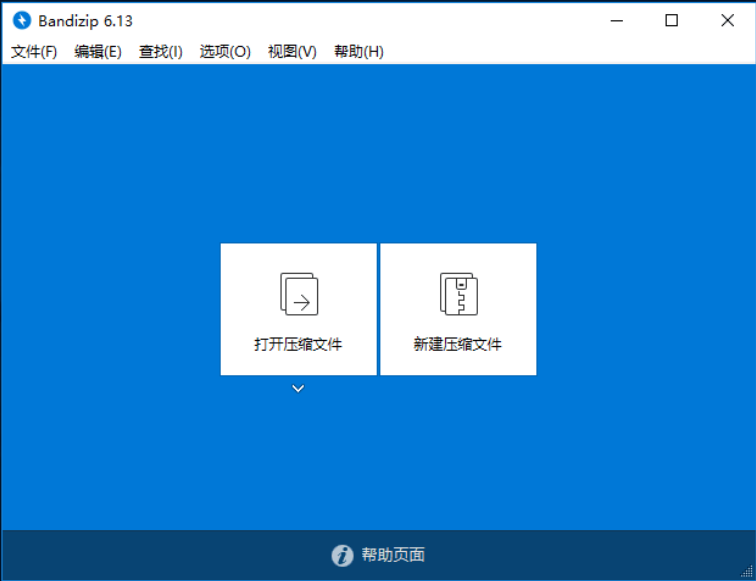
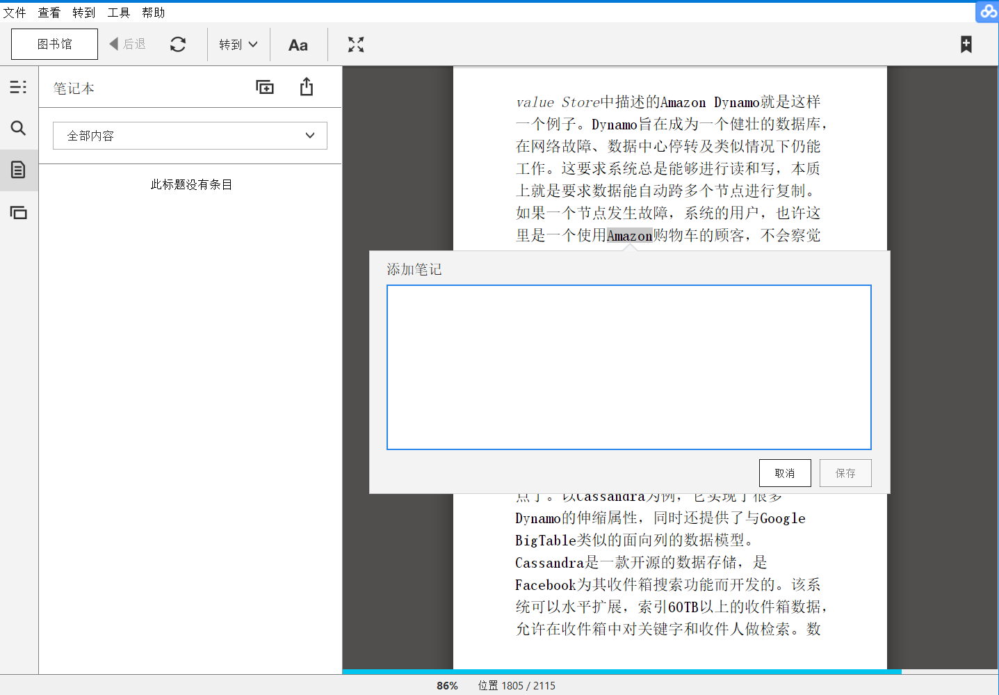

# 下载篇

说到下载不得不说迅雷，但除了迅雷，还有一些其他的下载小工具跟大家讲讲。
## [迅雷](http://www.xunlei.com/)
说到迅雷，可能会有一部分人非常不屑，但又逃不过**定律**，这个软件我不截图了，大家都用过。
作为国产软件，无处不在的广告是少不了的，那我为什么要第一个推荐呢。
说实话我是外貌协会的，开始也非常鄙夷用迅雷下载。
但是，者确实是国内环境下，下载速度最快，占用系统资源最少，虽然广告多，但是很值得用的软件。
举个例子，我家乡（某个三四线城市）把全市访问**Jdk**官方下载链接都封了，无论啥工具，都下不了，但是，只有迅雷，迅雷能下，而且很快，我也是不得不服。
有人说还有idm啊，对，idm的确非常好用，但是ed2k和magnet协议的下载链接他还是不支持的，所以大家忍忍广告就用迅雷吧。

## [FDM](https://www.freedownloadmanager.org/) 

第二个还是不打算推荐IDM，因为FDM的界面，实在太简介了，太符合我的审美了，非常喜欢，下载速度也并不慢。
## [IDM](http://www.internetdownloadmanager.com/)

这个算是神器了吧，多线程下载，速度飞快，界面略简陋，很好用.

# 解压缩

## [Bandzip](http://www.bandisoft.com/bandizip/)

这里只推荐这一个，相当好看并且好用。

# 录屏
## [HoneyCam](http://www.bandisoft.com/honeycam/)

吐血推荐。

# 笔记

## [Evernote](https://www.yinxiang.com/)

这个不多说了。
## [OneNote](http://www.onenote.com/download/)

这是我最常用的，很喜欢微软的扁平化风格，国内同步稍微慢了点，但速度也仅次于国内软件，诸如有道云。因为许多场景用到微软的各种软件，所以笔记也跟着一起用了。

# 杂七
这个分类里主要介绍一些小而美的工具。

## [Listary](https://www.listary.com/)
是不是很羡慕mac平台自带的工具Spotlight工具呢，总之我是觉得很便捷了，这个软件可玩性很高，抽空会出一篇专题。当然不去过多设置两下ctrl就能调出的搜索框也很酷了。

## [Everything](http://www.voidtools.com/)

这是一个快到离谱的本地文件搜索工具，为什么这么快呢，其实eveerything并不是扫描文件，只是读取USN日志，不索引文件附加属性等等，所以它也有他的局限性，也就是只有NTFS才会有USN日志，所以在FAT、FAT32等格式文件系统中无法使用。基本上算是Windows党的福利。
## [Snipaste](https://www.snipaste.com/)
这玩意是仅次于qq截图的截图神器。不多说了。下就完事了。
另外，如果截图后还有编辑需要的，推荐**[Picpick](https://picpick.app/)**。
## [Xmind](https://www.xmind.net/)
非常非常良心的思维导图软件，算是轻量级的MindManager。该有的都有，平常开会拿手机，懒得记笔记，用这个。
## [Git](https://git-scm.com/)
程序员都懂，不多说。这玩意配合github，写文章也好，写代码也好，每次修改再也不用来回比对了。如果能下个GithubDesktop，当然更好。
## [Kindle for PC](https://www.amazon.com/Amazon-Digital-Services-LLC-Download/dp/B00UB76290)

看到这个是不是很意外，对于大多数人来说，一部kindle足够几乎所有阅读需求了，但是...
这个软件跟kindle一样，内容是Amazon提供的，完全不需要考虑不够的问题，其实最关键的功能是在书上做笔记，这个功能方便到极点，纸质书可以拿只笔写写画画，Kindle写起笔记来非常麻烦，要用双手。
所以，有看书需求的，下这个。
## [PinClipBoard](https://pinclipboard.com/)

不知道大家有没有这样的情况，我写技术方面的笔记时，经常用到一些代码，大部分是在编辑器里编辑好的，一篇文章插个1段代码不算多吧。我觉得多，巨多，来回来切，我要烦死，这个软件给了这样一种方式，把要粘贴的代码段都ctrl + c，要插入文章时，打开历史，双击历史记录，哦了。不用来回切界面，很方便。
这名字看起来就是个粘贴板吧，是的没有错，它就是粘贴板，但它有历史功能，图片收藏功能，文件夹收藏功能。

# 杂八

## Xmeters

状态栏小插件，用于显示内存、CPU等使用情况

